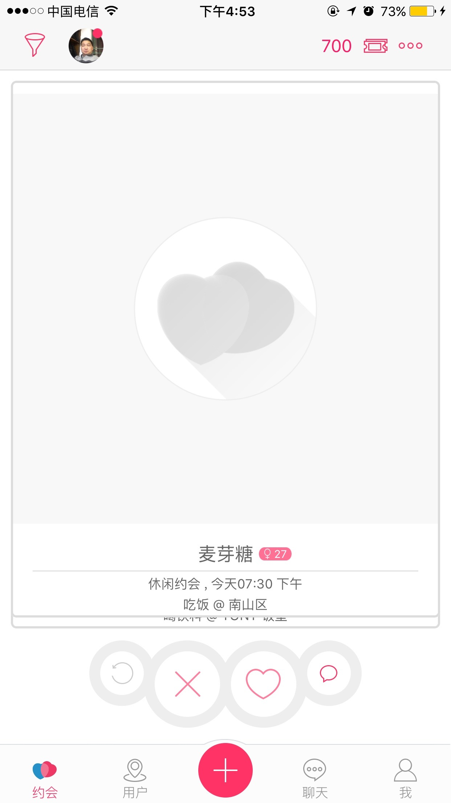

#IOS 新手教程(一)

##创建一个新的 None 的项目然后在新的项目里面添加 3 个类

>1: SuperTabBarViewController 继承与 UITabBarController

>2: SuperViewController 继承与 UIViewController

>3: SuperNavBarViewController 继承与 SuperViewController

##接下来开始仔细的介绍 3 个类不同的用法

> SuperTabBarViewController
> 
> 主要是用了修改 UITabBar 和 UITabBarItem.
> 

### 例子:
自定义 tabBar 背景的方法

```swift
override func viewDidLoad() {
        let backView = UIImageView.init(image: UIImage.init(named: "tab_bg"))
        backView.frame = CGRectMake(0, -10, UIScreen.mainScreen().bounds.size.width, 55)
        self.tabBar.insertSubview(backView, atIndex: 0)
        self.tabBar.opaque = true
        self.tabBar.backgroundColor = UIColor.init(rgba: "#fbfcfc")
}
```
### 例子:
自定义 tabBar items 的方法

```swift
func setTabBarItems(){
        for i in 0..<self.tabBar.items!.count {
            let tempTabBar = self.tabBar.items![i]
            var titleStr: String = ""
            var tempStr1: String = ""
            var tempStr2: String = ""
            switch i+1 {
            case 1:
                titleStr = "Dates".localized()
                tempStr1 = "tabbar_dates_normal"
                tempStr2 = "tabbar_dates_selected"
                break
            case 2:
                titleStr = "People".localized()
                tempStr1 = "tabbar_people_normal"
                tempStr2 = "tabbar_people_selected"
                break
            case 3:
                
                tempStr1 = "tabbar_add_btn"
                tempStr2 = "tabbar_add_btn"
                break
            case 4:
                titleStr = "Chats".localized()
                tempStr1 = "tabbar_chats_normal"
                tempStr2 = "tabbar_chats_selected"
                break
            case 5:
                titleStr = "Me".localized()
                tempStr1 = "tabbar_me_normal"
                tempStr2 = "tabbar_me_selected"
                break
            default:
                
                break
            }
            
            tempTabBar.title = titleStr
            tempTabBar.image = UIImage(named: tempStr1)?.imageWithRenderingMode(UIImageRenderingMode.AlwaysOriginal);
            tempTabBar.selectedImage = UIImage(named: tempStr2)?.imageWithRenderingMode(UIImageRenderingMode.AlwaysOriginal);
            let attributes  =  [NSForegroundColorAttributeName: UIColor(red:1, green:0.18, blue:0.39, alpha:1), NSFontAttributeName: UIFont(name: "Heiti SC", size: 12.0)!]
            
            let attributesN  =  [NSFontAttributeName: UIFont(name: "Heiti SC", size: 12.0)!]
            tempTabBar.setTitleTextAttributes(attributesN , forState: .Normal)
            tempTabBar.setTitleTextAttributes(attributes , forState: .Selected)
        }
    }
```

最后的效果



著作权声明：本文由赵品评(pinping@me.com)原创，欢迎转载分享。请尊重作者劳动，转载时保留该声明和作者博客链接，谢谢